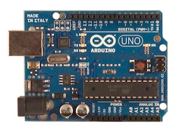
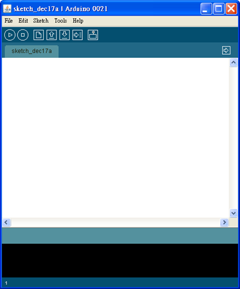
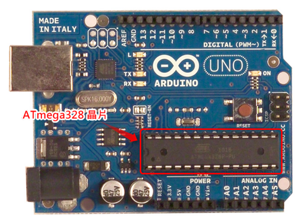
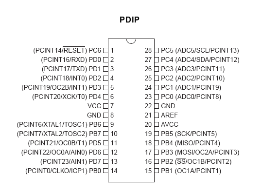
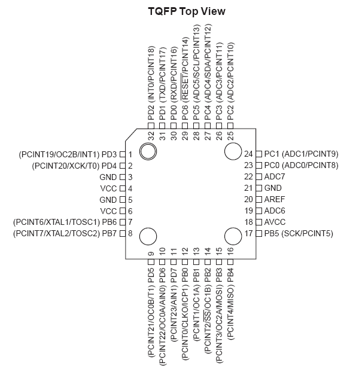
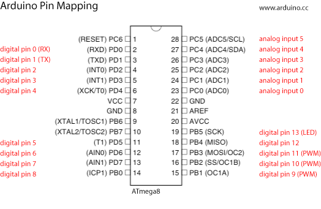
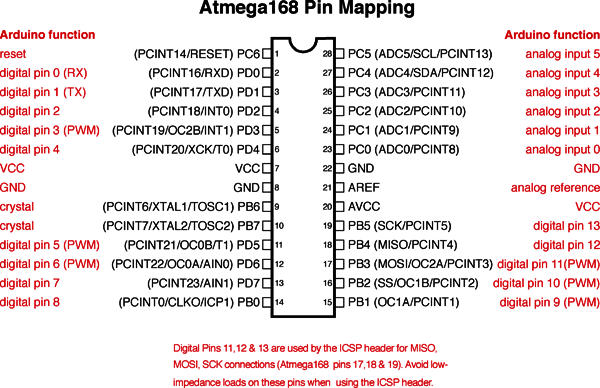
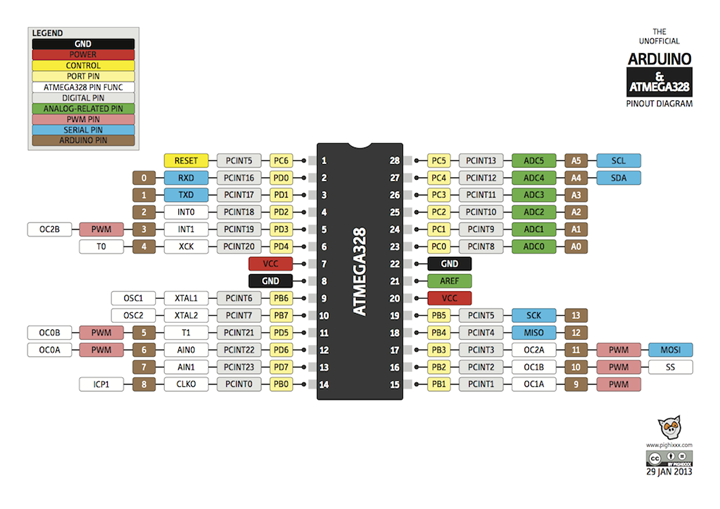
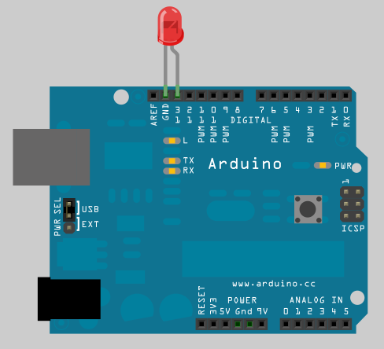
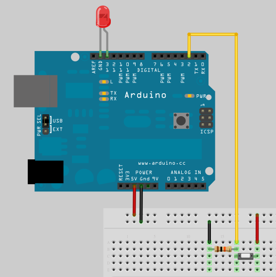

## 從 Arduino 到 AVR 晶片(1) -- AVR 晶片與 IO ports 範例 (作者：Cooper Maa)

### 前言

單晶片微電腦 (Single Chip Microcomputer)，或稱微控制器 (Microcontroller，縮寫為 µC 或 MCU)，是一個將 CPU、記憶體、I/O Port 等周邊電路全部整合為一體的晶片。不像微處理器需要外部電路連接周邊，微控制器的應用只要少許的電路就可以運作，因為所有必要的周邊它都內建了。微控制器主要用在嵌入式系統，例如汽車電子、工業控制、機械控制等領域。

著名的 Arduino 板子上也有一顆微控制器，它是 AVR 的晶片，例如 Arduino UNO, Duemilanove 用的是 ATmega328，Arduino Diecimila 的是 ATmega168，而早期的 Arduino USB 則是使用 ATmega8。

Arduino 在歐美非常流行，因為它超簡單，很快就可以上手，我認為從 Arduino 到 AVR 是一條進入單晶片韌體開發的捷徑，因此著手撰寫這一系列的教學文件，希望這可以幫助想學單晶片韌體開發的新手，也希望能夠拋磚引玉，藉此引出高手發表佳文，同時也希望路過的先進不吝指教。

#### 教學目標

我假設讀者你是單晶片新手，我不打算一次把所有與單晶片有關的東西全塞到你腦袋裏，因為這麼做其實是揠苗助長，適得其反，因此這系列的教學將維持 Arduino 一貫的簡約風格，點到為止。這系列教學的目標為：

* 帶你認識 AVR 單晶片以及其周邊，包括 I/O Ports, Interrupt, Timer, USART, PWM, ADC 等。

#### 授課對象

你必須具備下列基礎:

* 寫過 Arduino 程式 
        * 如果你沒接觸過 Arduino，建議你先看「 [Arduino 入門教學](http://coopermaa2nd.blogspot.com/2011/05/arduino.html) 」。 
* 熟悉 C 語言

#### 上課器材

你需要一張 Arduino 板子，一條 USB 傳輸線，以及 Arduino IDE 軟體開發環境:







### 1. AVR 晶片簡介

AVR 是 ATmel 這家公司設計的 8 位元晶片，晶片架構來自於 Alf-Egil Bogen 和 Vegard Wollan 的構想。AVR 是 Alf (Egil Bogen) and Vegard (Wollan) 's Risc processor 的縮寫。

AVR 目前大概可分為下列幾個家族:

8-bit tinyAVR 系列
8-bit megaAVR 系列
8/16-bit XMEGA 系列
32-bit AVRs 系列
排愈後面的等級愈高，主要是記憶體較大、速度較快、腳位和周邊也比較多。

如果沒有特別聲明，這系列教學中提到的 AVR 指的都是 8 位元的晶片。

#### Arduino 與 AVR 晶片的關係

前面說過，Arduino 用的就是 AVR 的晶片，你可以在 Arduino 板子上找到 AVR 晶片，以 Arduino UNO 為例，晶片所在的位置如下圖所示:



在 arduino.cc [這個頁面](http://arduino.cc/en/Main/Hardware) 中，條列了 Arduino 各種版本的板子、硬體規格、所用的 MCU 等資訊。下列是幾款 Arduino 跟它們所用的 MCU 對照表:

* Arduino UNO: ATmega328
* Arduino Duemilanove: ATmega328 (剛出道時使用 ATmega168)
* Arduino Diecimila: ATmega168
* Arduino Mega: ATmega1280
* Arduino Mega 2560: ATmega2560
* Arduino NG: ATmega168 (剛出道時使用 ATmega8)
* Arduino USB: ATmega8
* ATmega328 晶片的重要特性

Arduino UNO 和 Duemilanove 用的是同一顆 ATmega328 晶片，下表是 ATmega328 的晶片特性摘要:

特性                     說明
---------------------    ------------------------------
Operating Voltage        1.8V - 5V
Flash Memory             32 KB
SRAM                     2 KB
EEPROM                   1 KB
Clock Speed              16 MHz
External Interrupt       2
Timer                    Two 8-bit Timer/Counters with Prescaler and Compare Mode. One 16-bit Timer/Counter with Prescaler, Compare and Capture Mode
PWM Channel              6 Channels
ADC Channel              8 Channels 10-bit ADC in TQFP package. 6 Channels 10-bit ADC in PDIP package
USART                    1
SPI                      1
TWI                      Phlilips I2C compatible

如果你是第一次接觸單晶片，表中很多名詞你可能不認識。不用擔心，這張表你現在只要大概瀏覽一下即可，這些周邊之後會一個個介紹。

#### ATmega328 的晶片封裝(IC package)

一般來說，晶片的封裝分成 PDIP 和 TQFP 兩種封裝。

註:

* PDIP 是 Plastic Dual Inline Package 的縮寫，指的是塑膠雙排針腳式封裝。
* TQFP Thin Quad Flat Pack 的縮寫，指的是薄型方形扁平封裝。

以 Arduino UNO 所用的 ATmega328 為例，它屬於 PDIP 封裝，其 I/O 腳位配置圖 (Pinout) 如下:



而 ATmega328 TQFP 封裝的 I/O 腳位配置圖 (Pinout) 如下:



### 2. I/O Ports

Arduino 板子所用的晶片 (以 ATmega8 和 ATmega168/328 為例) 有三個 8-bit 的 PORTs :

* B: 對應 Arduino 的 digital pin 8 to 13
* C: 對應 Arduino 的 analog input pin 0 to 5
* D: 對應 Arduino 的 digital pins 0 to 7

#### Arduino 與 AVR 晶片腳位對應表

底下這張圖顯示 Arduino 跟 ATmega8 之間的腳位對應關係:



例如，Arduino 的 pin 13 對應的腳位為 PB5。

而底下是 Arduino 跟 ATmega168 的腳位對應關係圖:



Arduino UNO 和 Arduino Duemilanove 用的晶片都是 ATmega328，Arduino Diecimila 用的是 ATmega168，而早期的 Arduino USB 則是使用 ATmega8。

註: ATmega328 跟 ATmega168 的腳位配置 (Pinout) 是一模一樣的。

* 2013/4/12 補充: 有個叫 Pighixxxx 的義大利人畫了很多 [Arduino 的 pinout diagrams](http://arduino.cc/forum/index.php/topic,146315.0.html) ，搭配這些圖學習會更方便。



#### I/O Ports 暫存器簡介

AVR 晶片每個 port 都受三個暫存器控制，分別是 (x 代表 B, C, D):

* DDRx 暫存器: 用來決定腳位是 INPUT 或 OUTPUT。
* PORTx 暫存器: 用來控制腳位輸出訊號為 HIGH 或為 LOW
* PINx 暫存器: 用來讀取腳位的輸入訊號

### 2.1 Blink part 1

#### 實驗目的

讓一顆燈號閃爍，每隔一秒切換一次燈號。 

#### 材料

* Arduino 主板 x 1
* LED x 1

#### 接線

把 LED 接到 Arduino 板子上，LED 長腳 (陽極) 接到 pin13，短腳 (陰極) 接到 GND，如下圖：



#### 程式碼

先來看 Arduino 版本的 Blink 程式:

```CPP
/*
 * Blink.pde: 讓一顆燈號閃爍，每隔一秒切換一次燈號
 */

const int ledPin =  13;         // LED pin

void setup() {                
  pinMode(ledPin, OUTPUT);      // 把 ledPin 設置成 output pin 
}

void loop() {
  digitalWrite(ledPin, HIGH);   // 打開 LED 燈號 
  delay(1000);                  // 延遲一秒鐘
  digitalWrite(ledPin, LOW);    // 關閉 LED 燈號 
  delay(1000);                  // 延遲一秒鐘
}
```

這是 Arduino 的入門程式，相信你應該很熟悉。

從 Arduino 與 AVR 腳位對應關係圖可知，PB5 就是 pin 13，所以現在我們可以改用 I/O Ports 暫存器重新改寫程式:

```CPP
/*
 * Blink.pde:  讓一顆燈號閃爍，每隔一秒切換一次燈號
 * schematic:
 *   Connect a LED on PB5 (Arduino pin 13)
 */

void setup()
{
  DDRB |= (1 << 5);      // 把 PB5 設置成 output pin 
}

void loop()
{
  PORTB |= (1 << 5);     // 打開 LED 燈號
  delay(1000); 
  PORTB &= ~(1 << 5);    // 關閉 LED 燈號 
  delay(1000);
}
```

PB5 是 PortB 的 bit 5，所以我們用  (1 << 5) 當作位元遮罩 (bit mask)。 要特別注意的是，在設定 DDRx 暫存器的時候，1 是代表 OUTPUT，而 0 是代表 INPUT。

### 2.2 Blink part 2 : 用 _BV() 巨集把程式變得清晰易讀

前一篇的程式，如果用 _BV() 巨集改寫的話，會變得比較清晰易讀:

```CPP

/*
 * BlinkWithBV.pde:  讓一顆燈號閃爍，每隔一秒切換一次燈號，使用 _BV() 巨集
 * schematic:
 *   Connect a LED on PB5 (Arduino pin 13)
 */

/* 在 avr-libc 中的 sfr_defs.h 有這樣的定義:
#define _BV(bit) (1 << (bit))
*/

void setup()
{
  DDRB |= _BV(5);      // 把 PB5 設置成 output pin
}

void loop()
{
  PORTB |= _BV(5);     // 打開 LED 燈號
  delay(1000); 
  PORTB &= ~_BV(5);    // 關閉 LED 燈號
  delay(1000);
}
```

BV 是 Bit Value 的縮寫。_BV() 巨集的定義為:

```CPP
#define _BV(x) (1 << x)
```

所以 _BV(5) 就是 bit 5，由此我們馬上可以聯想到，DDRB |= _BV(5) 這行代表的是「把 PB5 這支腳位設置設 OUTPUT」(註: 1 是 OUTPUT，0 是 INPUT)。

#### 位元遮罩

我們可以把前面的程式稍微改良一下:

```CPP
/*
 * BlinkWithbitMask.pde: 讓一顆燈號閃爍&#65292;每隔一秒切換一次燈號&#65292;使用 _BV() 巨集
 * schematic:
 *   Connect a LED on PB5 (Arduino pin 13)
 */

/* 在 avr-libc 中的 sfr_defs.h 有這樣的定義:
#define _BV(bit) (1 << (bit))
*/

#define bitMask _BV(5)  // bit mask of PB5

void setup()
{
  DDRB |= bitMask;      // 把 PB5 設置成 output pin
}

void loop()
{
  PORTB |= bitMask;     // 打開 LED 燈號
  delay(1000); 
  PORTB &= ~bitMask;    // 關閉 LED 燈號
  delay(1000);
}
```

利用 bit mask (位元遮罩) 的概念，把 _BV(5) 定義成 bitMask 巨集，這麼一來，當 LED 接到別支腳位，不再是 PB5 時，程式只需要調整 bitMask 巨集，其它地方都不用修改。

#### Arduino 腳位的位元遮罩對照表

利用位元遮罩的概念，我們可以進一步這樣做:

```CPP

/*
 * digitalPin_to_bitmask.pde:  
 *  讓一顆燈號閃爍&#65292;每隔一秒切換一次燈號&#65292;使用 _BV() 巨集與位元遮罩 
 * schematic:
 *   Connect a LED on PB5 (Arduino pin 13)
 */

// bit masks of Arduino digital pins
const byte digital_pin_to_bit_mask[] = {
	_BV(0), /* 0, port D */
	_BV(1),
	_BV(2),
	_BV(3),
	_BV(4),
	_BV(5),
	_BV(6),
	_BV(7),
	_BV(0), /* 8, port B */
	_BV(1),
	_BV(2),
	_BV(3),
	_BV(4),
	_BV(5),
	_BV(0), /* 14, port C */
	_BV(1),
	_BV(2),
	_BV(3),
	_BV(4),
	_BV(5),
};

const int ledPin = 13;   // PB5
const byte bitMask = digital_pin_to_bit_mask[ledPin]; // will get _BV(5)

void setup()
{
  DDRB |= bitMask;      // 把 PB5 設置成 output pin
}

void loop()
{
  PORTB |= bitMask;     // 打開 LED 燈號
  delay(1000); 
  PORTB &= ~bitMask;    // 關閉 LED 燈號
  delay(1000);
}
```

在這個範例中，我們建了一個 Arduino digital pin 的位元遮罩對照表 digital_pin_to_bit_mask。我們知道， pin 13 就是 PB5，有了這張對照表，就可以很容易算出 pin 13 的位元遮罩，像這樣:

```CPP
const int ledPin = 13;   // PB5
const byte bitMask = digital_pin_to_bit_mask[ledPin]; // will get _BV(5)
```

這會得到 _BV(5)，也就是 PB5 的位元遮罩，亦即 pin 13 的位元遮罩。

#### 動動腦

雖然上面的程式可以算出 Arduino digital pin 的位元遮罩，但是如果進一步思考會發現一個問題：因為 setup() 和 loop() 已經固定使用 PORTB，所以即便算出其它腳位的位元遮罩，比如座落在 PD2 的 pin 2 (位元遮罩是 _BV(2) )，到時真正受影響的卻還是 PB2。因此，如果你想控制 pin 2，除了改 ledPin 外，你還得修改 setup() 和 loop() 把其中的 DDRB 換成 DDRD，而 PORTB 換成 PORTD，這樣才行。

想想看，這個問題要怎麼解決才好呢?

### 2.3 Button

#### 實驗目的

使用按鍵 (PushButton) 控制 LED，按鍵被按下時打開 LED，按鍵放開時關掉 LED。
材料

* Arduino 主板 x 1
* LED x 1
* Pushbutton x 1
* 10K 歐姆電阻 x 1
* 麵包板 x 1
* 單心線 x N

#### 接線

把 LED 接到 pin 13，長腳 (陽極) 接到 pin 13，短腳 (陰極) 接到 GND
把 pushbutton 一支腳接到 +5V，另一支腳接到 pin 2 同時接一顆 10K 電阻連到 GND



#### 程式碼

先來看 Arduino 版本的 Button 程式:

```CPP

/*
 * Button.pde: 使用按鍵 (PushButton)控制 LED 燈號的開關
 */

const int buttonPin = 2;                 // 按鈕(pushbutton)
const int ledPin = 13;                   // LED

int buttonState;                         // 用來儲存按鈕狀態

void setup() {
  pinMode(ledPin, OUTPUT);               // 把 ledPin 設置成 OUTPUT
  pinMode(buttonPin, INPUT);             // 把 buttonPin 設置成 INPUT
}

void loop(){
  // 讀取按鈕的狀態
  buttonState = digitalRead(buttonPin);

  // 檢查按鈕是否被按下
  // 是的話&#65292;buttonState 會是 HIGH
  if (buttonState == HIGH) {     
    digitalWrite(ledPin, HIGH);          // 打開 LED
  } 
  else {
    digitalWrite(ledPin, LOW);           // 關閉 LED
  }
}
```

從腳位對應關係圖可知，PB5 就是 pin 13，而 PD2 就是 pin 2，所以現在我們可以改用 I/O Ports 暫存器重新改寫程式:

```CPP

/*
 * Button.pde: 使用按鍵 (PushButton)控制 LED 燈號的開關
 * 
 * Pin map:
 *  Arduino pin 13 = PB5
 *  Arduino pin  2 = PD2 
 */

// 底下兩個常數程式沒有用到，只是當作參考 
const int buttonPin = 2;           // 按鈕(pushbutton)
const int ledPin = 13;             // LED

#define buttonPinBitMask  _BV(2)   // pin 2  = PD2
#define ledPinBitMask     _BV(5)   // pin 13 = PB5

int buttonState;                   // 用來儲存按鈕狀態

void setup()
{
  DDRB |= ledPinBitMask;           // 把 ledPin 設置成 OUTPUT
  DDRD &= ~buttonPinBitMask;       // 把 buttonPin 設置成 INPUT
}

void loop()
{    
  // 讀取按鈕的狀態
  if (PIND & buttonPinBitMask) {
    buttonState = HIGH;
  } else {
    buttonState = LOW;     
  }

  // 檢查按鈕是否被按下
  // 是的話&#65292;buttonState 會是 HIGH  
  if (buttonState == HIGH) {
    PORTB |= ledPinBitMask;         // 打開 LED
  } else {
    PORTB &= ~ledPinBitMask;        // 關閉 LED
  }
}
```

程式為 PD2 和 PB5 兩支腳位分別定義了 buttonPinBitMask 和 ledPinBitMask 兩個位元遮罩，利用這兩個位元遮罩進行位元運算，透過 DDRx 暫存器決定腳位是 INPUT 或 OUTPUT 模式，用 PINx 暫存器讀取按鈕的腳位狀態，然後用 PORTx 暫存器控制 led 腳位的輸出訊號。 _BV() 巨集我們在前面已經介紹過。

到此相信你對 AVR 晶片的 I/O Ports 應該已經有足夠的了解了。

#### 延伸閱讀

* [ATmel 官網: AVR 8- and 32 bit](http://www.atmel.com/products/avr/default.asp?category_id=163&family_id=607&source=left_nav)
* [ATmega168/328 Datasheet](http://www.atmel.com/dyn/resources/prod_documents/8271S.pdf)
* [Wikipedia 百科全書: ATmel AVR](http://en.wikipedia.org/wiki/Atmel_AVR)
* [Port Registers](http://www.arduino.cc/en/Reference/PortManipulation)
* [Arduino 筆記 – Lab1 Blinking a LED](http://coopermaa2nd.blogspot.com/2010/12/arduino-lab1-blinking-led.html)
* [_BV 巨集介紹](http://feedproxy.google.com/~r/CooperMaa/~3/O55sTkSt7pA/bv.html)
* [Arduino 筆記 – Lab2 使用按鍵控制 LED 燈號](http://coopermaa2nd.blogspot.com/2010/12/arduino-lab2-led.html)

【本文作者為馬萬圳，原文網址為： <http://coopermaa2nd.blogspot.tw/2011/07/from-arduino-to-avr.html> , <http://coopermaa2nd.blogspot.tw/2011/07/1-avr.html> , <http://coopermaa2nd.blogspot.tw/2011/07/2-io-ports.html> , <http://coopermaa2nd.blogspot.tw/2011/04/21-blink-part-1.html> , <http://coopermaa2nd.blogspot.tw/2011/07/21-blink-part2.html> , <http://coopermaa2nd.blogspot.tw/2011/07/22-button.html> ，由陳鍾誠編輯後納入本雜誌】

