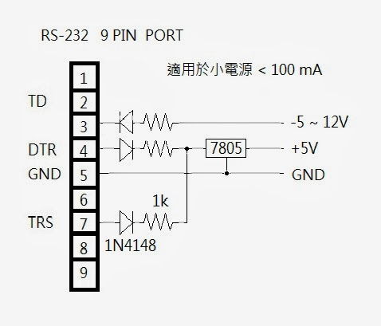

## 從 RS-232 偷電的方法 (作者：Bridan)

[RS-232](https://zh.wikipedia.org/wiki/RS232)  是一個很古老的通訊界面，寫 [韌體](http://4rdp.blogspot.tw/2008/03/blog-post_24.html) 的工程師只要有弄過通訊，一定知道它，現在只剩桌上型電腦可以找到這樣的介面，今天就分享如何從電腦 RS-232 介面偷電。

圖中所有二極體是 1N4148，所有電阻都是 1 kΩ，這電路只能提供小電源。

RS-232 雖然在電腦介面已經被 USB 取代，不過它的非同步通訊 [UART](https://zh.wikipedia.org/wiki/UART)  仍被各類 MCU 保留，它只需 TX、RX 兩隻腳就可以傳送與接收，像 [NXT](http://4rdp.blogspot.tw/search/label/LEGO%20MINDSTORMS%20NXT)  的藍芽模組就是利用 UART 與 MCU 通訊。

(本文來自「研發養成所」 Bridan 的網誌，原文網址為 <http://4rdp.blogspot.tw/2014/01/rs-232-power.html> ，由陳鍾誠編輯後納入程式人雜誌)

