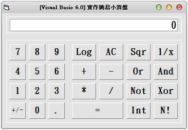

## Visual Basic 6.0:實作簡易小算盤 (作者：廖憲得 0xde)



```MonoBasic
Dim NumberTemp, Temp, S
Private Sub Command1_Click(Index As Integer)
    Select Case Command1(Index).Caption
        Case 0, 1, 2, 3, 4, 5, 6, 7, 8, 9
            If Temp <> "" And S Then S = False: Text1.Text = 0
            Text1.Text = Val(Text1.Text & Command1(Index).Caption) ' 是數值就 And 完後 Val
        Case "+/-"
            Text1.Text = -Text1.Text ' * -1 等於 補負號
        Case "."
            If InStr(Text1, ".") = 0 Then Text1.Text = Text1.Text & "." ' 判斷沒有點的話在加一個點
        Case "Log"
            If Val(Text1.Text) > 0 Then Text1.Text = Log(Val(Text1.Text)) / Log(10) ' VB6 的 Log 公式為 Log(數值) / Log(N) N = 底數
        Case "AC"
            Text1.Text = 0 ' 將顯示歸零
            Temp = "" ' 運算暫存清空
        Case "Sqr"
            Text1.Text = Sqr(Text1) ' 開根號的函數為 Sqr (數值)
        Case "1/x"
            Text1.Text = 1 / Text1.Text ' 倒數
        Case "N!"
            Text1.Text = N(Text1.Text) ' 呼叫階乘副程式
        Case "Int"
            Text1.Text = Int(Text1.Text)  ' 取整數
        Case "+", "-", "*", "/", "And", "Xor", "Or", "Not"
            S = True
            If Temp = "" Then ' 當運算元為空時
                Temp = Command1(Index).Caption ' 紀錄運算元
                NumberTemp = Text1.Text ' 紀錄運算子
            Else
                Call Change(Temp) ' 運算
                Temp = Command1(Index).Caption ' 紀錄運算元
                NumberTemp = Text1.Text ' 紀錄運算子
            End If

        Case "="
                Call Change(Temp) ' 運算
                NumberTemp = Text1.Text ' 紀錄運算子
    End Select
End Sub

Function Change(N) ' 運算
   If N <> "" Then
        Select Case N
            Case "+"
                Text1.Text = NumberTemp + Val(Text1.Text)
            Case "-"
                Text1.Text = NumberTemp - Val(Text1.Text)
            Case "*"
                Text1.Text = NumberTemp * Val(Text1.Text)
            Case "/"
                Text1.Text = NumberTemp / Val(Text1.Text)
            Case "Or"
                Text1.Text = NumberTemp Or Val(Text1.Text)
            Case "And"
                Text1.Text = NumberTemp And Val(Text1.Text)
            Case "Xor"
                Text1.Text = NumberTemp Xor Val(Text1.Text)
            Case "Not"
                Text1.Text = Not NumberTemp
        End Select
    End If
End Function
Function N(Inp) ' 階乘副程式
    If Inp = 1 Then
        N = 1
    Else
        N = Inp * N(Inp - 1)
    End If
End Function
```

* 原始碼下載： [實作簡易小算盤.rar](http://files.dotblogs.com.tw/0xde/1311/2013117191823675.rar)

【本文作者為「廖憲得」，原文網址為： <http://www.dotblogs.com.tw/0xde/archive/2013/11/07/127248.aspx> ，由陳鍾誠編輯後納入本雜誌】
