## 符式協會論文文件編輯入門教學(1) – 作業環境準備 (作者：鄧淵元)

### 論文文件編輯筆記 - 作業環境準備

#### 教學目的

減少協會成員、講員處理投稿文件的編輯時間，增進協會編輯相關論文。（待編輯）

#### 作業系統支援

-  Windows 平台
-  OSX 平台
-  Linux 平台

本入門篇將先以 Windows 作業系統為主要的教學平台，介紹相關的軟體安裝與設定。如果您需要 OSX 或 Linux 等作業系統的安裝說明，請再與臺灣符式推廣協會聯絡。

#### 基礎環境設定

請您預先檢查您的電腦是否已經安裝底下四種軟體，

1. 解壓縮軟體: 7-zip(請注意有區分 32/64 位元版本), WinRAR, WinZip等，擇一即可。
2. 輸入法： 新酷音輸入法, 或是您熟悉使用的輸入法均可。
3. 文字編輯器： Notepad++, EMEditor, vim 等，擇一即可。
4. PDF瀏覽器： PDF Xchange Viewer(請注意有區分 32/64 位元版本)。

如果還沒安裝，請先跳至附註說明，安裝相對應的軟體後，再繼續往「安裝協會論文出版相關軟體」處進行後續的步驟。

#### 安裝協會論文出版相關軟體

1. Dev C++: 文件轉檔將使用 makefile 來管理相關的輸入與輸出參數。
2. Pandoc： 主要的文件轉檔引擎。
3. Markdown 編輯器： MarkdownPad 2 Free。
4. Calibre：電子書管理工具，主要拿來轉 epub 與 pdf 格式使用。
5. MikTeX: Windows 平台 LaTeX 系統，能支援相關科學論文排版，數學方程式輸入等。
6. texmaker: 編輯 LaTex 格式文件。

#### Dev C++

請使用預設的安裝設定值安裝 Dev-C++ 即可，我們主要是要拿 MinGW 中的幾個程式來使用。

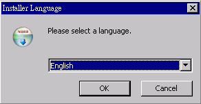

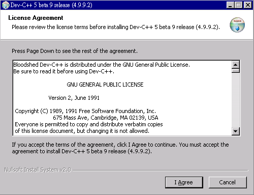

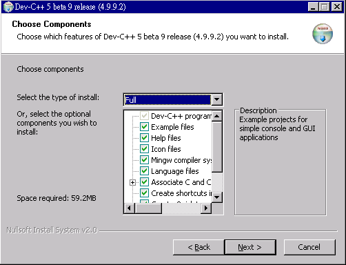

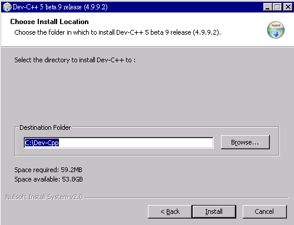

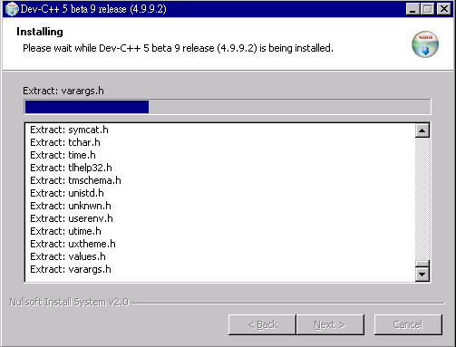

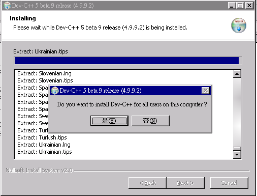

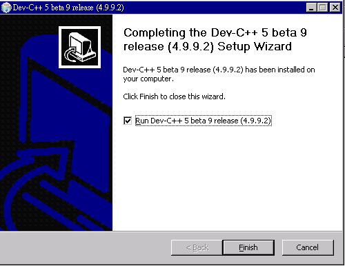

安裝完後，請檢查環境變數是否有加入

```
c:\Dev-Cpp\bin
```

這個環境變數，這樣才能搜尋得到 **make.exe** 與 **MinGW** 的相關執行檔。 

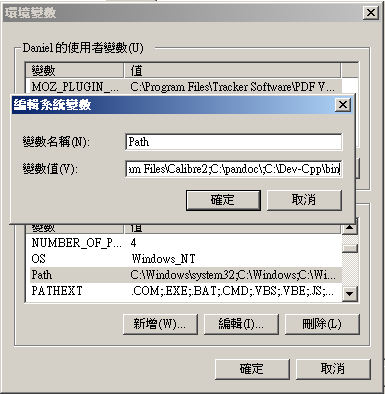

---

#### Pandoc

安裝 Windows 板的 pandoc 要注意，如果直接安裝，系統將會安裝在

1. WinXP
```
C:\Documents And Settings\USERNAME\Application Data\pandoc
```

2. Win7
```
C:\Users\USERNAME\AppData\Roaming\pandoc
```

這樣的路徑太長，我們不好使用與閱讀相關的設定文件。因此建議您開啟命令列視窗來安裝 Pandoc 。

```
c:\>msiexec /i pandoc-1.12.4.msi.windows.installer.msi allusers=1 applicationfolder="c:\pandoc"
```

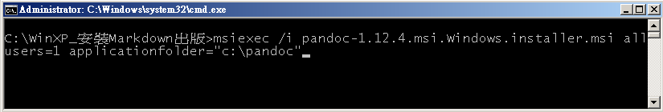

其餘就按照預設的安裝設定安裝即可。

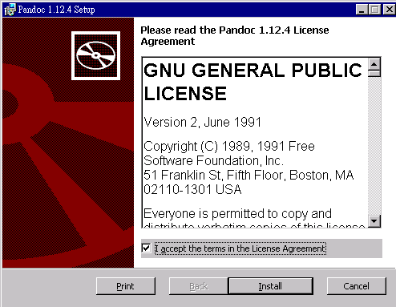

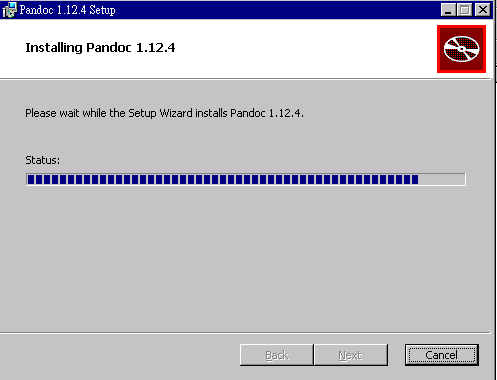

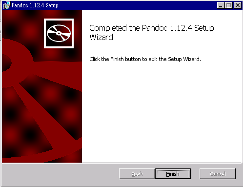

安裝完成後，應該會在 **PATH** 環境變數中加入 

```
c:\pandoc
```

您可以在安裝目錄中查看 pandoc 的使用手冊。

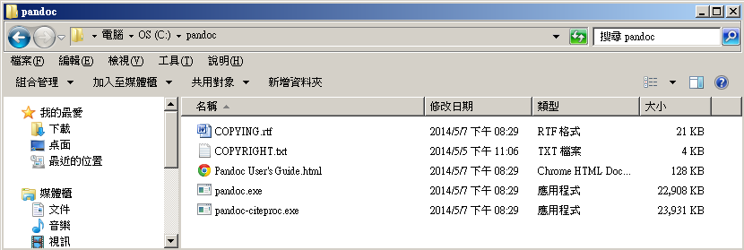


---

#### Markdown 編輯器 ####

使用預設值安裝即可

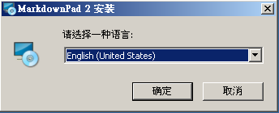

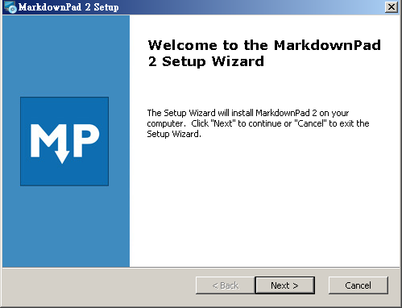

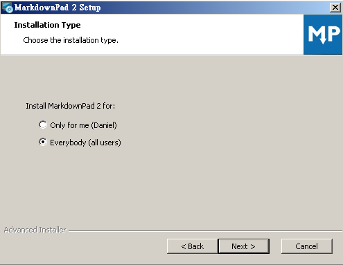

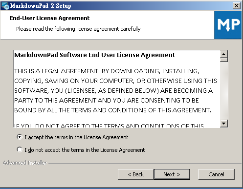

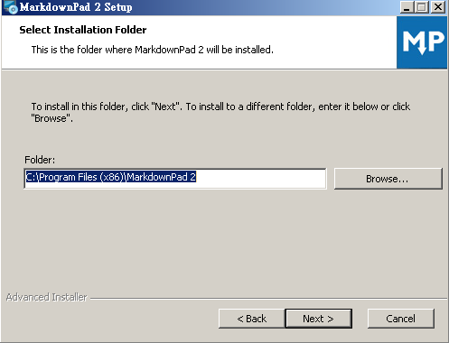


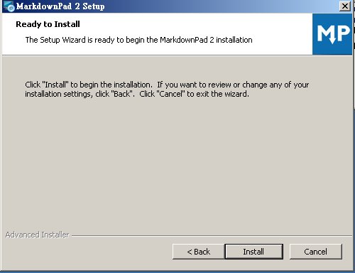

安裝過程中會需要裝 Visual C++ 2010 x86 可轉散發套件。 

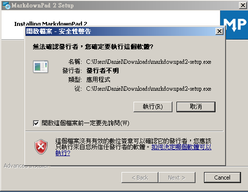

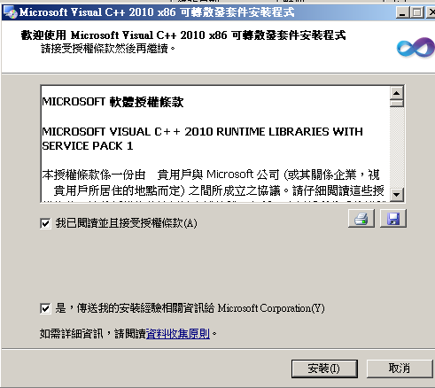

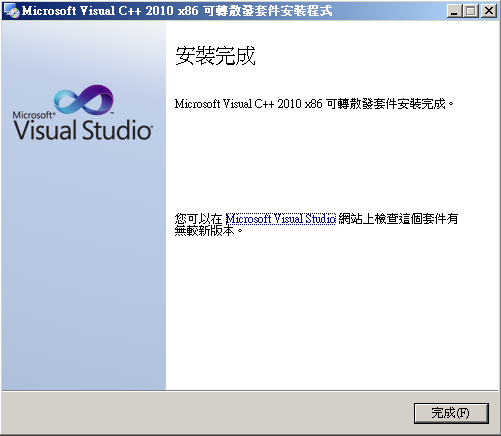

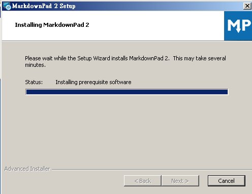


個人編輯是不需要升級到專業版。如果您認為好用，也可以贊助購買，鼓勵作者的辛勞。


在 **選項/編輯器/語言** 處可以選擇「中文（中華民國）」。

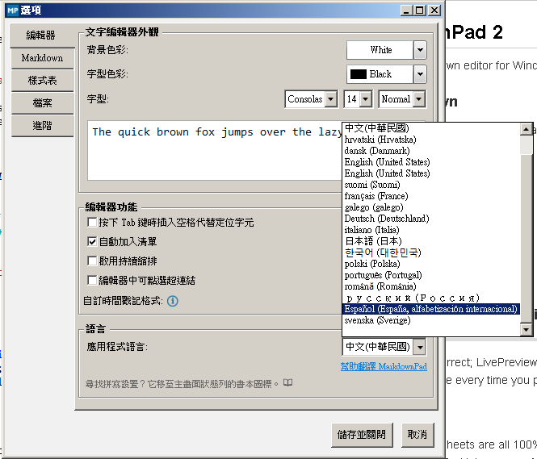

安裝完成後，您就可以編輯第一篇 Markdown 文件。

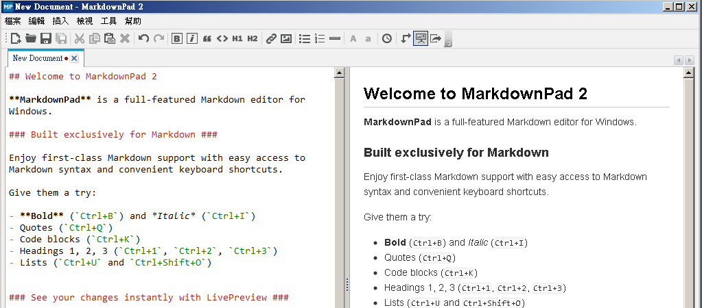

----

#### Calibre ####

下載軟體的時候要特別注意，如果您是使用 32位元的系統，請下載 Windows 版本，如果是使用 64 位元的系統，請選擇下載 Windows 64 bit 版本。


使用預設值安裝即可


軟體安裝後，不需要立即執行。

---

#### MikTeX #### 

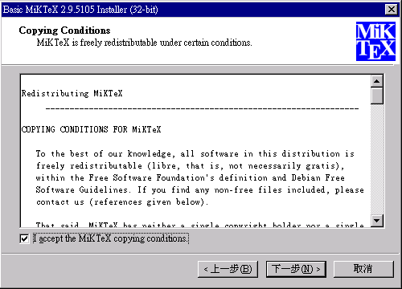

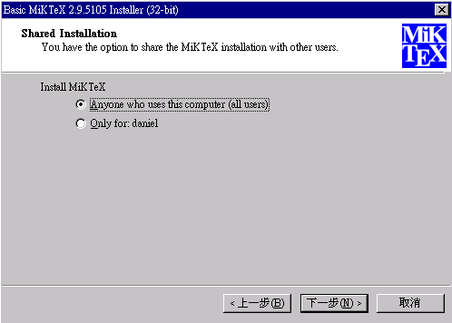

請使用預設的安裝目錄即可

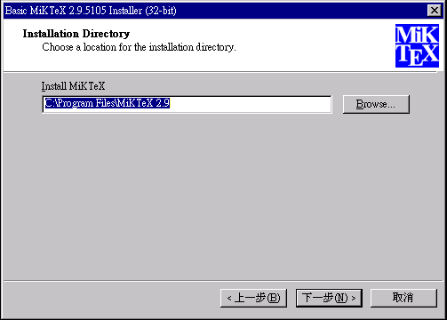

請注意紙張是否設定為 **A4**，請不要設定成 **letter**。

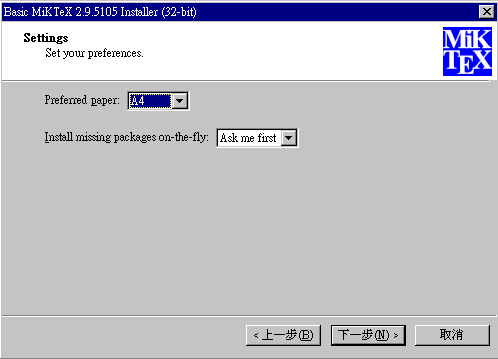

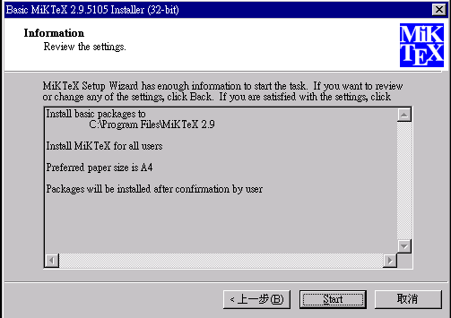

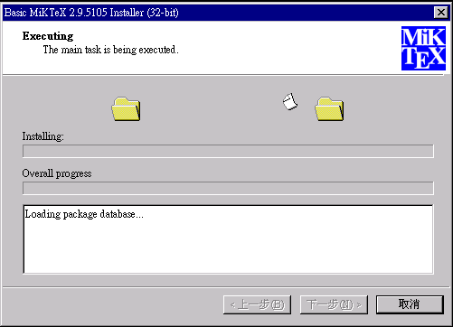

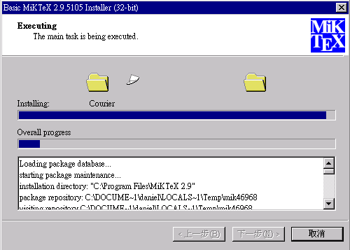

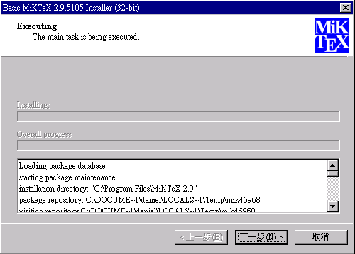

安裝完成

##### MikTeX 套件更新與安裝

主要會用到 **Setting(Admin)** 和 **update(Admin)** 這兩個功能
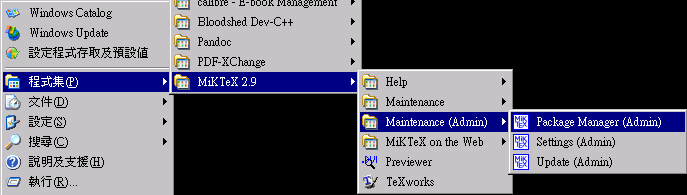

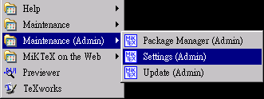

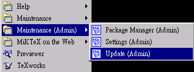


請先從鏡像站中選出 **http://shadow.ind.ntou.edu.tw** ，然後準備更新相關套件。

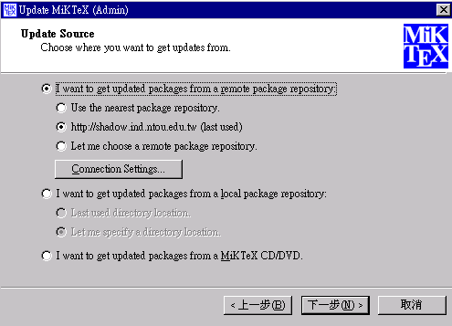

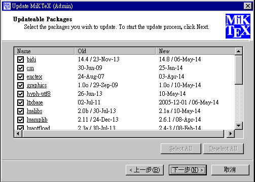

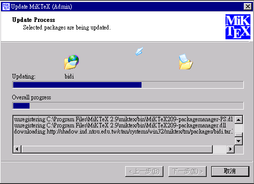

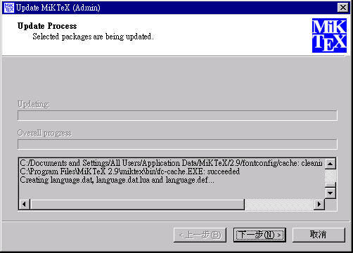

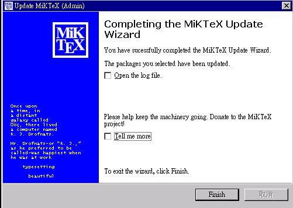

完成更新的工作，接著打開套件管理員Package Manager(Admin)，來安裝其餘的軟體。請在 keywords 輸入框中輸入**xelatex**，準備安裝相關的套件。 

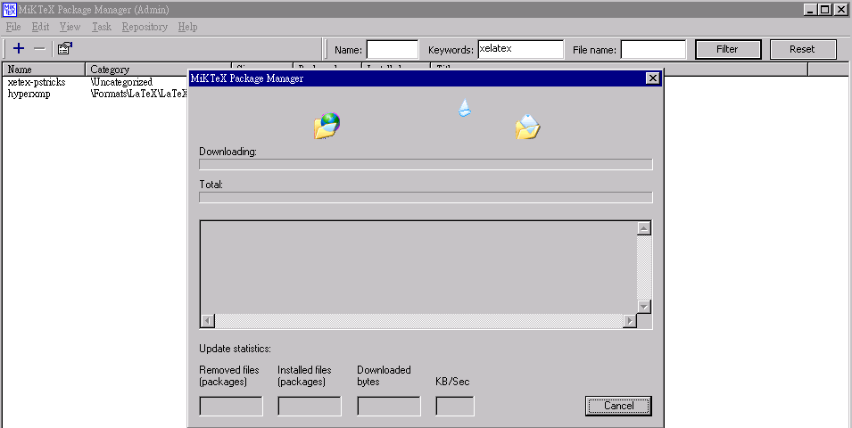

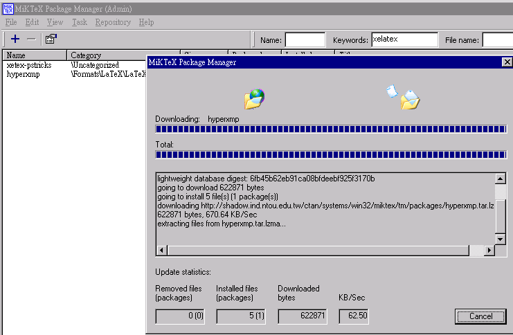


#### texmaker 

texmaker 主要的功能是編輯 LaTeX 文件，預設安裝，不經過設定是沒有辦法直接處理含有中文的文件，更別說要產出具有數學方程式且又要包含中文字的論文。因此我們要測試是否有辦法透過設定，讓 LaTeX 產生中文的 pdf 文件。


請使用預設的安裝目錄即可
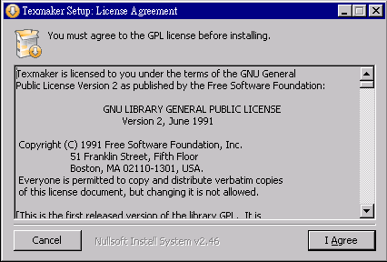

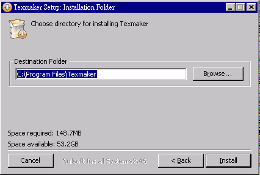

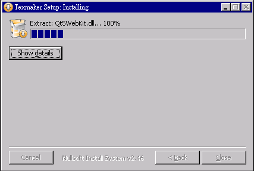

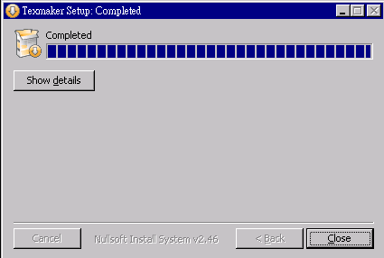


##### 設定 texmaker 
安裝完畢後，請啟動軟體，然後點選 **選項/設定 Texmaker**。

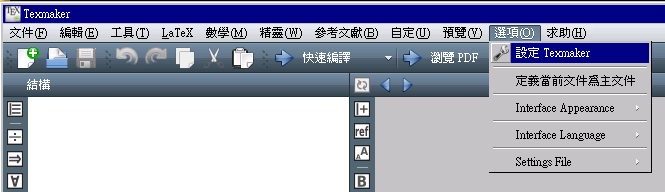

過去要讓 LaTeX 系統能處理中文論文排版是相當複雜的安裝與設定工作，主要的問題除了版本眾多(要另外裝 cwTeX, chiTeX...等)，安裝中文字型也是一個很繁瑣的問題，更別說還要處理多國語言文字。自從 MiTeX 系統支援 UTF-8 編碼與 xeTeX 系統後，處理中文論文也就變得容易許多。只要設定幾個步驟，就能開始編輯支援中文的 LaTeX 文件。

先將 **命令** 設定的 **LaTeX** 指令改為

```
xelatex -interaction=nonstopmod %.tex
```

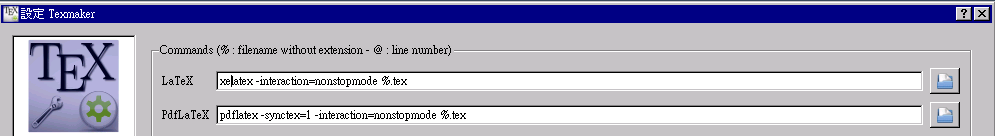

PDF 文件檢視器請自行指定成您電腦中的 PDF Reader 。

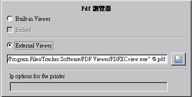

在 **快速編譯** 的設定，請點選 **自訂**，然後加入類似底下的設定指令

```
xelatex -interaction=nonstopmod %.tex | "c:/Program Files/Tracker Software/PDF Viewer/PDFXCview.exe" %.pdf | bibtex %.aux | xdvi %.dvi
```


再來是設定 **編輯器** 中的 **編輯器字型編碼** 為 **UTF-8**，然後最好也勾選 **顯示行號**。這樣就完成初步的設定。


不過在設定完成的過程當中，因為需要一些額外的套件，此時 MikTeX 系統的套件管理員會自動提示是否要安裝，請直接選擇 **Install** 安裝即可。


##### 編輯 LaTeX 文件測試

請用 **texmaker** 開啟一個檔案，然後輸入底下的測試文件

```
\documentclass{article}

\usepackage{fontspec}    %加這個就可以設定字體
\usepackage{xeCJK}       %讓中英文字體分開設置
\setCJKmainfont{標楷體}   %設定中文為系統上的字型，而英文不去更動，使用原TeX字型
\XeTeXlinebreaklocale "zh"             %這兩行一定要加，中文才能自動換行
\XeTeXlinebreakskip = 0pt plus 1pt     %這兩行一定要加，中文才能自動換行
\title{社團法人臺灣符式推廣協會\\103年度年會論文集}
\author{陳爽}
\date{\color{green}中華民國103年6月7日} %設定日期

\begin{document}
\maketitle
社團法人臺灣符式推廣協會。

English Test. 插入中文字，看看如何？ I like Forth. 

要插入一段數學方程式$y=ax+b$也沒問題，當然也可以輸入一些複雜的方程組或是矩陣。

        \[
       x_{1}^{(k+1)} = \frac{1}{a_{11}}(b_{1} - \sum_{j < 1}{a_{1j}x_{j}^{(k+1)}} - \sum_{j > 1}{a_{1j}x_{j}^{(k)}})
       \]
        \[
       x_{2}^{(k+1)} = \frac{1}{a_{22}}(b_{2} - \sum_{j < 2}{a_{2j}x_{j}^{(k+1)}} - \sum_{j > 2}{a_{2j}x_{j}^{(k)}}) 
       \]
\end{document}

```


---

* 社團法人臺灣符式推廣協會 -- <http://www.figtaiwan.org>


